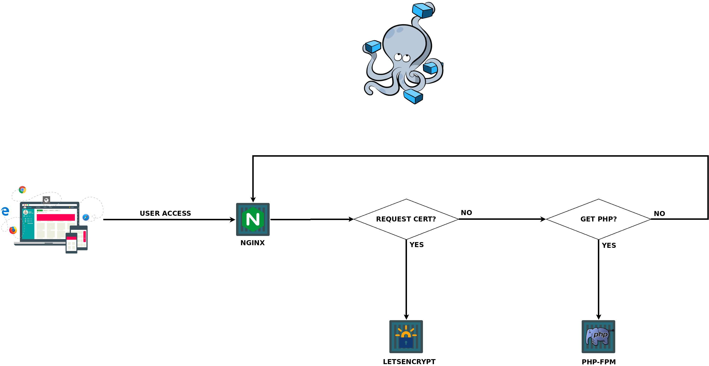

# Numeric Calculus

- [Containers](https://github.com/bgcorreia/calculoNumerico#containers)
- [Infrastructure](https://github.com/bgcorreia/calculoNumerico#infrastructure)
- [Installation](https://github.com/bgcorreia/calculoNumerico#installation)
- [Pre-execution](https://github.com/bgcorreia/calculoNumerico#pre-execution)
- [Execution](https://github.com/bgcorreia/calculoNumerico#execution)
- [SSL](https://github.com/bgcorreia/calculoNumerico#ssl)

## Containers

- *Webserver* - Nginx;
- *Letsencrypt* - Nginx;
- *Backend PHP* - PHP-fpm;

3 Containers.

## Infrastructure



## Requisites

- Docker version 17.09.1-ce or above (https://docs.docker.com/install/)
- Docker Compose 1.20.1 or above (https://docs.docker.com/compose/install)

## Installation

Clone the repository recursively with:
```
user@host:~# git clone --recurse-submodules https://github.com/bgcorreia/calculonumerico.git
```
This mode the repositorys the frontend and backend are cloned.


## Pre-execution

Create file `.env` in root directory on repository informing enviremont variables, example content:

```bash
user@host:~/calculonumerico# cat .env
APPNAME=www
DOMAIN=domain.com
EMAIL_LETS=email@domain.com
TOKEN=token_seguro_p_webhook
REPOSITORIO_WEBFILES=https://github.com/bgcorreia/calculoNumerico-webfiles.git
RAMO=master
DIRETORIO=/var/www/html/
```

Define permissions for user `www-data` in directory back/front which will be mounted as volume in container. Because the user may not exist on the host host, we use the gid that is standard on any system. Execute:

```bash
user@host:~/calculonumerico# chown 33:33 -R volumes/calculoNumerico-webfiles
```

## Execution

For `production` mode, in the root repository, execute the next command:

```bash
user@host:~/calculonumerico# docker-compose up -d
```

For `local` mode, in the root repository, execute the next command:

```bash
user@host:~/calculonumerico# docker-compose -f docker-compose-local.yml up -d
```

The option `-d` execute containers in background.

## SSL

Per default, the first execution use no-ssl. Case need use ssl, after execution (with containers running), do following:

```
user@host:~/calculonumerico# docker exec numerico_letsencrypt  bash -c 'certbot certonly --email ${EMAIL_LETS} -a webroot --webroot-path=${DIRETORIO} -d ${FQDN} -d ${DOMAIN} --agree-tos'
```

OBS.: Use option -d according with need.

After, in projecty directory:

```
user@host:~/calculonumerico# docker-compose restart webserver_numerico
Restarting proxy ... done
```

Enjoy!
